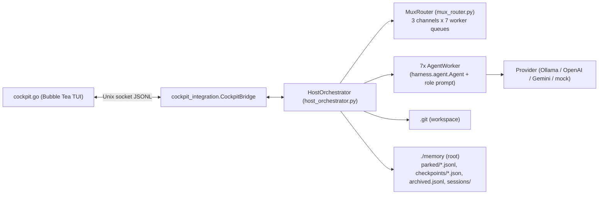
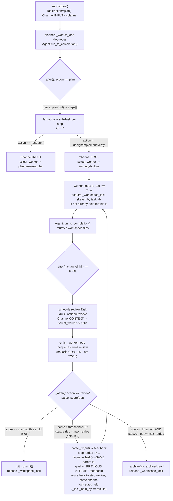

# MUX Cockpit Architecture

Deep-dive reference for how `host_orchestrator.py`, `mux_router.py`, `morph_engine.py`, and
`harness/session.py` fit together. Every section below is grounded in the current source —
file/section pointers are given informally in prose so claims can be checked against the code
directly.

## System map



Every worker is a `harness.agent.Agent` with its own persistent session directory
(`root/sessions/<worker_id>`). The host owns all scheduling — workers never talk to each other
directly, they only dequeue `Task`s the `MuxRouter` hands them and post results back through
`HostOrchestrator._after()`.

## 1. The 3-channel MUX priority model

`mux_router.py` defines three channels as an `IntEnum`:

- `Channel.INPUT` (0) — user goals, research
- `Channel.CONTEXT` (1) — memory/RAG, critic review
- `Channel.TOOL` (2) — implementation / file-mutating tool work

Dequeue priority is host-driven and fixed, not FIFO across channels:

```python
PRIORITY_ORDER = (Channel.TOOL, Channel.INPUT, Channel.CONTEXT)
```

`MuxWorkerQueue` (one per worker) holds a separate `asyncio.Queue` per channel and dequeues with
strict priority: `dequeue()` loops `PRIORITY_ORDER` and returns the first non-empty queue's head,
so a queued TOOL task is always served before an INPUT task, which is always served before a
CONTEXT task, regardless of arrival order. The loop waits on a single `asyncio.Event` (`_ready`)
rather than racing multiple `Queue.get()` calls — the docstring calls this out explicitly ("no
leaked getters"). A `parked` worker's `dequeue()` never returns a task even if its queues aren't
empty; it just blocks on `_ready` until unparked.

Per-worker admission is gated by a `TokenBucket`: continuous refill (`capacity / per_seconds`,
default 8000 tokens/hour per worker via `MuxRouter.__init__`'s `tokens_per_hour` param), consumed
by `HostOrchestrator._worker_loop` after each turn (`self.router.token_bucket[w.id].consume(spent)`).
`MuxRouter.route()` treats "parked", "full" (`depth() >= max_depth`, default 32), or
"`token_bucket[worker_id].available < min_tokens`" as equivalent backpressure signals — in every
case the task is spilled to disk instead of enqueued (see §5). `route()`'s own docstring states
the guarantee directly: *"Never drops a task."*

## 2. The 7-worker swarm and routing

`WORKER_IDS = ("planner", "builder", "critic", "security", "devops", "researcher", "xr")`.
`HostOrchestrator.DEFAULT_ROLES` maps each id to its role-prompt key:

| worker id | role (`ROLE_PROMPTS` key) | tool access |
|---|---|---|
| `planner` | `PLANNER` | full default toolset (`tools=None`) |
| `builder` | `BUILDER` | full default toolset |
| `critic` | `CRITIC` | `read, grep, find, ls, bash, todo` only |
| `security` | `SECURITY_ENGINEER` | `read, grep, find, ls, bash, todo` only |
| `devops` | `DEVOPS_ENGINEER` | full default toolset |
| `researcher` | `RESEARCHER` | `read, grep, find, ls, bash, todo` only |
| `xr` | `XR_COCKPIT` | full default toolset |

The restriction (`host_orchestrator.py`'s `HostOrchestrator.__init__` worker-construction loop)
withholds file-mutation tools (`edit`, `hashline_edit`, `write`) from `critic`, `security`, and
`researcher` — they can inspect and run commands but can't change files, which matches their
review/audit/research roles. `tools=None` resolves to `harness.tools.DEFAULT_TOOLS` inside
`Agent.__init__` (`names = list(tools or T.DEFAULT_TOOLS)`), i.e. the full toolset including
`edit`/`write`/`task`/`todo`/`checkpoint`/`rewind`.

`MuxRouter.select_worker(channel, priority)` picks a *preferred* worker by channel and priority,
then falls back to the least-loaded unparked worker if the preferred one is parked or full:

- `Channel.INPUT` → `planner` if priority is `critical`/`high`, else `researcher`
- `Channel.TOOL` → `security` if priority is `critical`, else `builder`
- `Channel.CONTEXT` (the `else` branch — used for review) → always `critic`

`HostOrchestrator.submit()` additionally special-cases the top-level goal submission: it calls
`select_worker(INPUT, priority)` but then re-forces the result back to `planner` unless `planner`
itself is parked, so a fresh goal always starts at the planner regardless of `select_worker`'s
load-aware fallback.

## 3. Task lifecycle: submit → plan → TOOL → review → commit/retry/archive

This is the core control loop, spanning `HostOrchestrator.submit()`, `_worker_loop()`, and
`_after()`.



Step-by-step, grounded in the actual branches of `_after()`:

1. **`submit(goal)`** creates `Task(id=uuid[:8], action="plan")`, routes it to `planner` on
   `Channel.INPUT`.
2. **Plan branch** (`task.action == "plan"`): `parse_plan(out)` extracts the last balanced
   `{"steps": [...]}` JSON object from the planner's output (falling back to the agent's own
   `todo` list if the model didn't emit one). For each step, `_after()` picks
   `Channel.INPUT` for `action == "research"` and `Channel.TOOL` for everything else
   (`design`/`implement`/`verify`), calls `select_worker()` for that channel/priority, builds a
   sub-`Task` with id `f"{task.id}.{s['id']}"`, and records it in `self.results[task.id]["steps"]`
   before routing it.
3. **TOOL execution**: in `_worker_loop`, `is_tool = task.channel_hint == Channel.TOOL`. Before
   running, if `is_tool and self._lock_held_by != task.id`, the worker `await`s
   `self._workspace_lock.acquire()` and sets `_lock_held_by = task.id` (see §4 for why). The
   worker then runs `Agent.run_to_completion()`.
4. **Post-TOOL branch** (`task.channel_hint == Channel.TOOL`, i.e. not a plan/review action):
   `_after()` wraps the goal + truncated output (`out[:6000]`) into a new review `Task` with
   `id=f"{task.id}.r"`, `action="review"`, `parent=task.id`, and routes it to
   `select_worker(Channel.CONTEXT, ...)` — which per §2 is always `critic`.
5. **Review branch** (`task.action == "review"`): `parse_score(out)` extracts the critic's
   `{"score": N, ...}`. `parent = task.parent` is the *original* TOOL task's id, and `_after()`
   looks up that task's step record in `self.results`.
   - **Score ≥ `commit_threshold`** (default `6.0`, overridable via `HostOrchestrator(commit_threshold=...)`):
     `_git_commit(f"{parent}: score {score:.1f}")` runs (`git add -A && git commit -m "mux: ..." --no-verify`,
     gated on `MUX_GIT=1` and a `.git` dir existing), and if the lock is still held for this task
     it is released.
   - **Score < threshold and retries remain** — **this is the current, live self-correction
     path, not a dead end**: `parse_fix(out)` extracts the critic's `{"fix": "..."}` suggestion.
     `step["retries"]` increments. A **new `Task` is built reusing the exact same `id` as the
     original step** (`id=parent`), with the goal rewritten to
     `f"{step['desc']}\n\nPREVIOUS ATTEMPT SCORED {score}/10 — CRITIC FEEDBACK: {fix}"`, and routed
     back to `step["worker"]` (the *same* worker that produced the rejected attempt — its
     `Agent` session still has the failed attempt in context) on the same channel
     (`TOOL` for implement/design/verify, `INPUT` for research). Because the retry `Task.id`
     equals the original `task.id`, `_worker_loop`'s `is_tool and self._lock_held_by != task.id`
     check evaluates `False` on the retry — the workspace lock is **not** re-acquired and stays
     continuously held from the first attempt through every retry until a final commit or archive.
   - **Score < threshold and retries exhausted** (`step.retries >= max_retries`, default `2`,
     overridable via `MUX_MAX_RETRIES`): `_archive(parent, out, score)` appends a JSON line to
     `root/archived.jsonl`, and the lock is released.

`max_retries` defaults to `2` (`HostOrchestrator.__init__`'s `max_retries` param, falling back to
`int(os.environ.get("MUX_MAX_RETRIES", "2"))`), so a rejected TOOL step gets up to 2 retries
(3 total attempts) before it is permanently archived instead of committed.

Failure paths that bypass `_after()` entirely (exceptions during `run_to_completion`, or
`Agent`'s own swallowed-exception `last_error` state) are archived directly by `_worker_loop`
without ever reaching the scoring logic, and release the workspace lock immediately if one was
held — see the `failed` branch in `_worker_loop`.

## 4. Workspace serialization lock

**Why it exists.** Git commits happen via `git add -A`, which stages *every* dirty file in the
workspace, not just the ones the committing task touched. Before this lock, two TOOL tasks
running concurrently against the same workspace could interleave: task A's `git add -A &&
git commit` would sweep up task B's half-finished, uncommitted edits into A's commit — silent
cross-task file contamination with no error.

**What it is.** `self._workspace_lock = asyncio.Lock()` plus `self._lock_held_by: Optional[str]`,
both set in `HostOrchestrator.__init__`. It is acquired the first time a TOOL task starts
executing and held across the **entire** execute → review → commit-or-retry-or-archive lifecycle
(§3) — not just the file-mutating step. It is released only on: a committed score, an archived
score (retries exhausted), a failed/errored task, a mid-task park/abort, or an exception inside
`_after()` (that last case is an explicit safety valve — the comment in `_worker_loop` notes that
without it, a bug in review-handling could "wedge the whole swarm's TOOL channel permanently").

**What it costs.** Quoting the `__init__` comment directly: *"a global lock, not
per-file/per-worktree -> builder/security/devops can't mutate files concurrently even on
unrelated tasks."* TOOL work is serialized **swarm-wide**, not per-file or per-branch — `builder`,
`security`, and `devops` effectively take turns even when their tasks touch disjoint files. INPUT
(planning/research) and CONTEXT (review) channels are unaffected; only TOOL-channel execution is
gated. The documented upgrade path, per the same comment, is per-task git worktrees if the
throughput loss becomes a real bottleneck.

**Known unfixed deadlock edge case**, also from that same comment block (verbatim): *"under heavy
load, `select_worker`'s fallback could route a review to a worker queued behind a lock-blocked
TOOL task ahead of it (priority order favors TOOL), deadlocking until that worker's queue drains
on its own — not solved here."* Concretely: `PRIORITY_ORDER` always serves a worker's TOOL queue
before its CONTEXT queue. If `select_worker`'s load-aware fallback ever routes a `review` task to
a worker whose TOOL queue already has a lock-blocked task ahead of it, that worker will keep
dequeuing (and blocking on) the TOOL task first, so the review needed to *release* the lock never
runs — a self-inflicted deadlock that only resolves if/when that worker's TOOL queue drains
through some other path. This is documented as an accepted risk, not patched.

## 5. Park / unpark / spill: zero-loss guarantee

`MuxRouter.route()`'s docstring states the contract: *"Returns 'queued' | 'spilled'. Never drops
a task."* Backpressure (worker parked, worker's queue at `max_depth`, or worker's token bucket
below `min_tokens`) never discards work — it always falls through to `_spill()`, which appends a
JSON line (`{"channel": int, "task": task.to_dict()}`) to `parked_dir / f"{worker_id}.jsonl"` on
disk (the `root/parked/` directory under the host's memory root, i.e. NVMe not RAM).

**`park(worker_id)`** (host level, `HostOrchestrator.park`) does three things in a specific order,
per its own comment: it sets `self.router.workers[worker_id].parked = True` *before* aborting a
possibly-in-flight agent stream, so that if `_worker_loop` resumes from the abort before
`router.park()` runs, its `if wq.parked:` guard (checked right after `run_to_completion` returns)
already sees `parked=True` and re-spills the interrupted task instead of treating a truncated
abort output as a normal completion. It then calls `self.router.park(worker_id)`, which drains
every queue for that worker in `PRIORITY_ORDER` (`MuxWorkerQueue.drain()`) and spills each drained
item to the same `<worker_id>.jsonl` file, and finally calls `self.checkpoint(worker_id)` to
snapshot the agent's session state to `root/checkpoints/` (§7) before marking the worker's status
`"parked"`.

**`unpark(worker_id)`** reads `<worker_id>.jsonl` line by line, re-enqueues each task
(`Task.from_dict`) into its original channel up to `max_depth` in-memory queue capacity, and
rewrites the file with only the lines that didn't fit back — so unparking is itself
backpressure-aware and idempotent: repeated calls keep restoring more until the file is empty.
`wq.parked = False` and `wq.wake()` resume dispatch.

Net effect: at any moment a task exists in exactly one of two places — an in-memory
`asyncio.Queue` (if the worker has capacity and is unparked) or a line in a `parked/*.jsonl` file
on disk — and both `park()`/`unpark()` and every `route()` backpressure path only move tasks
between those two states, never delete them. `HostOrchestrator.overnight_loop()` polls this
automatically: every `cadence` seconds (default 900s) it unparks any worker whose token bucket has
refilled to `>= min_tokens * 4` and whose global hourly quota isn't exhausted, and checkpoints any
worker still mid-`"running"`.

## 6. Role morphing

`morph_engine.RoleMorphEngine.morph(worker, new_role, keep_context=True)` swaps a worker's role
**without replacing the worker or its `Agent`** — "Morph agent" in the file's own docstring: *"A
worker IS a harness Agent with a persistent session. Morphing swaps the role prompt (and the LoRA
model tag, when installed) without touching the conversation."*

Steps, in order:
1. If the agent is mid-stream, `await agent.abort()` first.
2. **`keep_context` semantics**: if `keep_context=False`, `agent.new_session()` is called — this
   starts a brand-new `Session` (fresh JSONL file, empty entry list, no `leaf`), discarding the
   prior conversation history entirely. If `keep_context=True` (the default), this step is skipped
   and the existing session/entries/leaf are left untouched — the new role prompt is layered onto
   the *same* ongoing conversation, so the worker retains everything it has seen/done so far.
3. `agent.set_role(new_role, ROLE_PROMPTS[new_role])` swaps the role-prompt overlay.
4. `agent.model, worker.lora = lora_for(new_role, provider, base_model)` re-resolves the model tag.

`lora_for()` only does something for the `ollama` provider: it looks up `LORA_TAGS.get(role)`
(currently defined only for `PLANNER`, `BUILDER`, `CRITIC` in `harness/roles.py`), and if that tag
(or `f"{tag}:latest"`) is present in `provider.list_models()`, the worker's `agent.model` is
switched to that tag and `worker.lora` is set to the label for telemetry. Any other provider, or a
tag that isn't locally installed, silently falls back to the base model with `lora=None` — role
morphing degrades gracefully to "prompt swap only" when no matching LoRA adapter is available.

## 7. Session and checkpoint persistence

`harness/session.py`'s `Session` is an append-only JSONL log: a header line
(`{"type": "session", "id", "cwd", "name", ...}`) followed by entries linked by `id`/`parentId`,
each written to disk immediately on `append()`. The **active branch** is whatever `self.leaf`
points to; `path()` walks `parentId` links backward from `leaf` to the root and reverses them,
so history before a `branch_to()` call is never deleted, only detached from the active leaf —
`branch_to(entry_id)` is literally how `rewind` works: it moves `leaf` to an earlier entry and
appends a `"branch"` marker, so the *next* append forks a new path from that point while the
abandoned branch's entries remain on disk and in `self.entries`. `messages()` reconstructs the
active conversation for the model, honoring the most recent `"compaction"` entry by replacing
everything before it with a summary message.

`HostOrchestrator.checkpoint(worker_id)` is a separate, coarser mechanism layered on top: it
snapshots `{worker id, role, lora, tokens_used, context_tokens, session file path, session.leaf,
timestamp}` to `root/checkpoints/{worker_id}_{epoch_ms}.json`. This is a pointer/metadata
snapshot, not a copy of the conversation — the conversation itself lives durably in the `Session`
JSONL file already referenced by path; the checkpoint just records *which* leaf and how much
usage a worker was at, at a point in time. Checkpoints are written automatically inside `park()`
(before the worker is marked parked) and inside `overnight_loop()` for any worker still
`"running"` at the polling cadence, giving a recovery point without needing to interrupt a
mid-flight task.

## Reference: file → concept map

| File | Concept |
|---|---|
| `mux_router.py` | `Channel`, `PRIORITY_ORDER`, `Task`, `TokenBucket`, `MuxWorkerQueue`, `MuxRouter` (route/select_worker/park/unpark/spill) |
| `host_orchestrator.py` | `DEFAULT_ROLES`, `AgentWorker`, `HostOrchestrator` (submit/_worker_loop/_after/_git_commit/park/unpark/checkpoint/status/overnight_loop) |
| `morph_engine.py` | `RoleMorphEngine.morph`, `lora_for`, `parse_plan`/`parse_score`/`parse_fix`, `extract_json` |
| `harness/roles.py` | `ROLE_PROMPTS`, `ROLES`, `LORA_TAGS` |
| `harness/session.py` | `Session` (append/branch_to/path/messages), `load_session` |
| `harness/agent.py` | `Agent` (`DEFAULT_TOOLS` fallback, `run_to_completion`, subagent `task` tool) |
| `cockpit_integration.py` | Unix socket bridge (`CockpitBridge`) between `cockpit.go` and `HostOrchestrator` |
